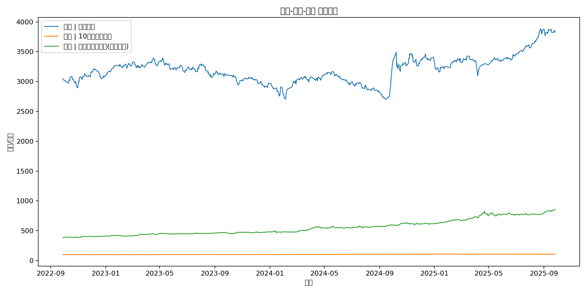
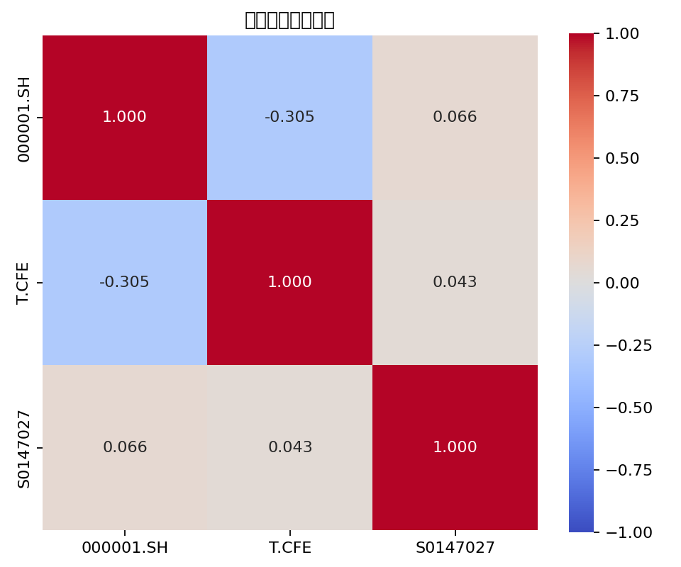
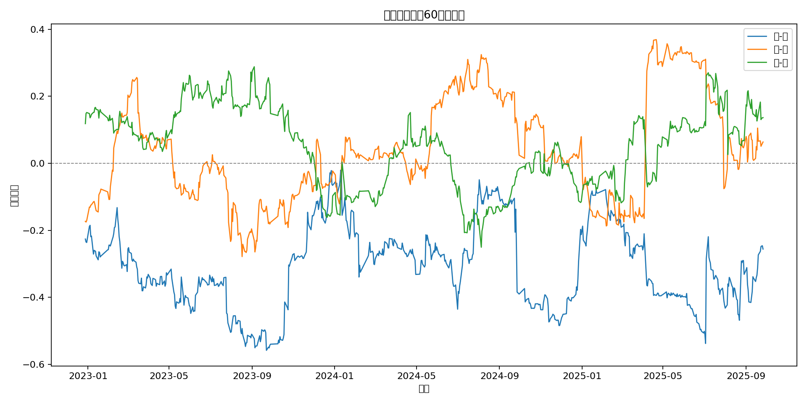

# 市场相关性分析报告

时间区间: 2022-09-28 ~ 2025-09-26

代表指数与字段:
- 股票: 000001.SH.close（上证指数）
- 债券: T.CFE.close（10年期国债期货）
- 黄金: S0147027.close（黄金期货收盘价(上海期货)）

核心结论:
- 股-债相关性: -0.305
- 股-金相关性: 0.066
- 债-金相关性: 0.043

图表预览:
- 价格走势: 
- 收益率相关性热力图: 
- 60日滚动相关性: 

数据文件:
- returns_correlation.csv: 日频收益率相关性矩阵
- prices.csv: 对齐后的价格序列
- returns.csv: 对齐后的收益率序列

方法说明:
- 以日频收盘价计算收益率（pct_change），在共同交易日对齐后计算皮尔逊相关性。
- 滚动相关性窗口为60个交易日，用于观察时变联动性。
